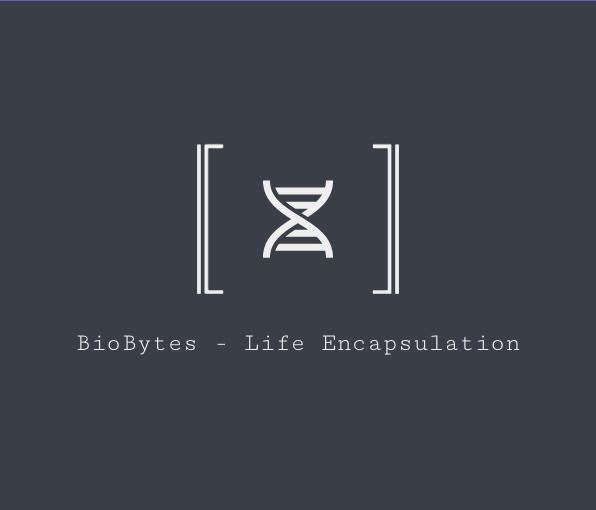

[Read this in Portuguese](README.pt-BR.md)



# BioBytes - Life Encapsulation

On a stormy night, in a messy lab, with the sky being torn apart by lightning and thunder, a project was given life... No, we're not talking about Dr. Frankenstein's monster. We're talking about something much more exciting: **BioBytes - Life Encapsulation**.

## Description

BioBytes is a miracle of modern science, the adored child of a biology daydream and a Python coding marathon. It's an artificial life simulator that allows you to create your own virtual ecosystem filled with organisms that behave strikingly similar to real life. They move, eat, grow, reproduce and, if that weren't enough, they also evolve!

## Prerequisites

To tame this beast of software engineering, you will need the following:

- Python 3.8 or higher (because who doesn't like snakes?)
- Docker (because cooking is fun, right?)
- Git (because we all need a bit of control)
- pip (Python's faithful package manager)

## Installation

Assembling BioBytes is like solving a puzzle for 5-year-olds. It's very easy if you can count to 4!

1. Clone the repository (like a modern-day code ninja):

    ```bash
    git clone https://github.com/ulissesflores/BioBytes
    ```

2. Navigate to the project folder (like a fearless explorer):

    ```bash
    cd BioBytes
    ```

3. Install the necessary dependencies (like a master chef):

    ```bash
    pip install -r requirements.txt
    ```

4. Build the Docker image (like a master builder):

    ```bash
    docker build -t biobytes .
    ```

## Usage

Now, brace yourself for the fun part! BioBytes is so easy to use that you might think it's a joke. (We will detail the use more here as the project evolves)

## Contributing

Tired of just watching and want to get in on the action? We'd love to have your contributions! You can help us make BioBytes even more amazing, whether it's by fixing a small typo or adding a new electrifying feature.

## License

BioBytes - Life Encapsulation is an open-source project that pulses with energy under the MIT License. You are free to use it, modify it, and distribute it for educational purposes. The only thing we ask is that you mention the brilliant scientist behind it all...

## Contact

Ulisses Flores, can be reached at c.ulisses@gmail.com. Don't forget to check out [MV9 Systems](https://www.mv9.com.br), the base where this project took life!

Now that you know what BioBytes is, are you ready to embark on this electrifying adventure of biology, code, and unlimited fun? Grab your lab coat and come in - evolution is calling!
