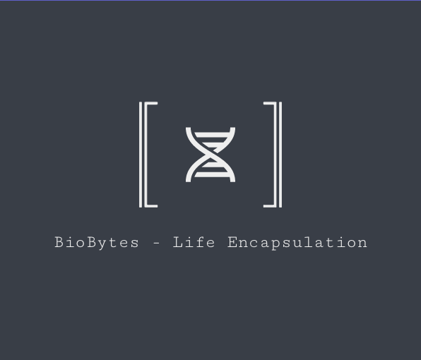

[Leia isto em inglês](README.md)



# BioBytes - Encapsulamento da Vida

Em uma noite tempestuosa, em um laboratório bagunçado, com o céu sendo rasgado por raios e trovões, um projeto foi dado à vida... Não, não estamos falando do monstro do Dr. Frankenstein. Estamos falando de algo muito mais empolgante: **BioBytes - Encapsulamento da Vida**.

## Descrição

BioBytes é um milagre da ciência moderna, o filho adorado de um devaneio de biologia e uma maratona de codificação Python. É um simulador de vida artificial que permite criar seu próprio ecossistema virtual repleto de organismos que agem de maneira estranhamente similar à vida real. Eles se movem, comem, crescem, se reproduzem e, se isso não bastasse, também evoluem!

## Pré-requisitos

Para domar essa fera da engenharia do software, você precisará do seguinte:

- Python 3.8 ou superior (porque quem não gosta de cobras?)
- Docker (porque cozinhar é divertido, certo?)
- Git (porque todos precisamos de um pouco de controle)
- pip (o fiel gerenciador de pacotes do Python)

## Instalação

Montar BioBytes é como resolver um quebra-cabeça para crianças de 5 anos. É muito fácil se você sabe contar até 4!

1. Clone o repositório (como um ninja do código moderno):

    ```bash
    git clone https://github.com/ulissesflores/BioBytes
    ```

2. Navegue até a pasta do projeto (como um explorador destemido):

    ```bash
    cd BioBytes
    ```

3. Instale as dependências necessárias (como um chef de cozinha):

    ```bash
    pip install -r requirements.txt
    ```

4. Construa a imagem do Docker (como um mestre da construção):

    ```bash
    docker build -t biobytes .
    ```

## Uso

Agora, prepare-se para a parte divertida! BioBytes é tão fácil de usar que você pode achar que é brincadeira. (Vamos detalhar o uso mais aqui conforme o projeto evoluir)

## Contribuição

Cansado de apenas assistir e quer entrar na ação? Adoraríamos receber suas contribuições! Você pode nos ajudar a tornar o BioBytes ainda mais incrível, seja corrigindo um pequeno erro de digitação ou adicionando uma nova funcionalidade eletrizante.

## Licença

BioBytes - Encapsulamento da Vida é um projeto de código aberto que pulsa com energia sob a Licença MIT. Você está livre para usá-lo, modificá-lo e distribuí-lo para fins educacionais. A única coisa que pedimos é que você mencione o nome do brilhante cientista por trás disso tudo...

## Contato

Ulisses Flores, pode ser alcançado em c.ulisses@gmail.com. Não se esqueça de conferir [MV9 sistemas](https://www.mv9.com.br), a base onde este projeto tomou vida!

Agora que você já sabe o que é BioBytes, está pronto para embarcar nesta aventura eletrizante de biologia, código e diversão ilimitada? Pegue seu laboratório e entre - a evolução está chamando!
